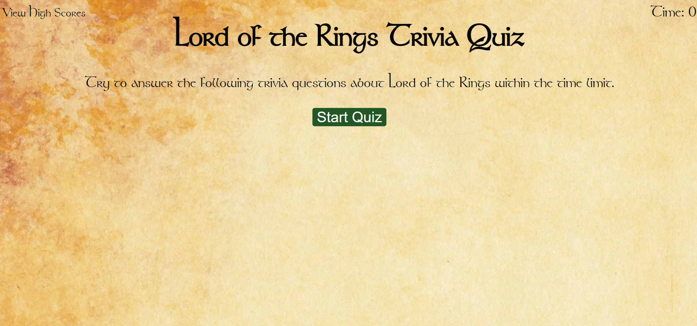

# Code-Quiz

This is a project to make a quiz. The quiz has a time limit, 5 questions, and a wrong answer deducts time from the time limit. The quiz then logs the highscore in local storage, and can be accessed on a seperate page to compare results between attempts.

